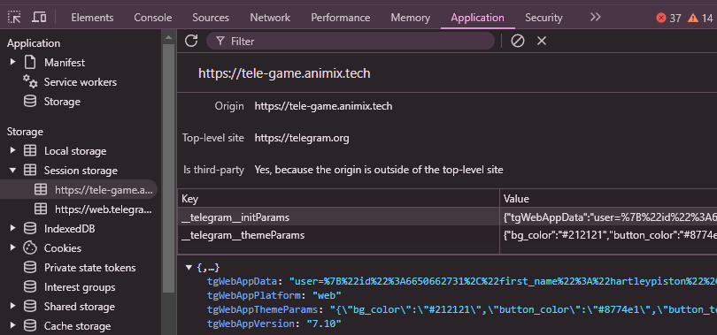

# Animix Miniapp Automation


This script automates various tasks for the Animix miniapp telegram.

## Features

- **Auto Join/Claim Missions**
- **Auto Gatcha New Pets**
- **Auto Complete Quests**
- **Auto Merge Pets**
- **Auto Claim Rewards**
- **Support Multy accounts**
- **Support Proxy Usage**

## Prerequisites

- Node.js installed on your machine
- `users.txt` file containing user data follow instruction below to get:
- Open Animix miniapp telegram [https://t.me/animix_game_bot](https://t.me/animix_game_bot?startapp=TL23Al89Yf6j)
- inspect or just F12 find application
- in session storage find `tgWebAppData` and copy all value. `user=....`


## Installation

1. Clone the repository:
    ```sh
    git clone https://github.com/hokireceh/animix.git
    cd animix
    ```

2. Install the required dependencies:
    ```sh
    npm install
    ```
3. Input your user data in `users.txt` file, one user per line;
    ```sh
    nano users.txt
    ```
4. optionally you can use proxy: 
- paste proxy in `proxy.txt` format `http://username:password@ip:port` 
    ```sh
    nano proxy.txt
    ```
5. Run the script:
    ```sh
    npm run start
    ```

## ☕️ Traktir kopinya & Thanks for Supporting us:

- https://sociabuzz.com/silviaroyshieta/tribe
- **EVM : `0x5d4fe1f909015d35bd4d9b51a38ea5c3c8a4c6ea`**
- **SOLANA : `FUaAeT5ZAT4ifPYPTWfKnvvqmi6yJdTPvHapG5gqcGZW`**

## 

This project is licensed under the [MIT License](LICENSE).
